# Question-Answer Pair Generator App

## Problem Statement
Creating high-quality assessment questions manually is time-consuming and requires domain expertise. This system automates question generation for:
- Educational institutions (teachers creating tests)
- E-learning platforms (automated quiz generation)
- Corporate training (assessment creation)
- Content creators (interactive material development)

## Key Features
- **Multi-format Questions**: Generates 6+ question types (MCQ, True/False, Descriptive, etc.)
- **Adaptive Difficulty**: Creates questions matching beginner to advanced levels
- **Context-Aware**: Maintains semantic relevance to input material
- **Local Processing**: Runs entirely on your machine using Ollama LLMs
- **Customizable**: Easily modify prompts and templates

## Core System Components

### Key Modules and Their Roles
| Module | Purpose | Key Functions |
|--------|---------|---------------|
| `main.py` | User interface | Collects input, manages workflow |
| `utl.py` | Text processing | Cleans text, validates questions |
| `prompts.py` | AI instructions | Templates for question generation |
| `llm.py` | AI integration | Handles Ollama API interactions |
| `page1.py` | Results display | Shows questions with toggleable answers |

### Data Flow Highlights
1. **Input Collection**:
   - User provides context text (200+ words)
   - Selects question parameters via Streamlit UI

2. **Processing**:
   - Text cleaned and normalized
   - Custom prompts generated
   - AI creates questions with answers

3. **Output**:
   - Interactive question display
   - Export options (PDF/Text)

## Interactive System Visualization

```mermaid
%%{init: {'theme': 'base', 'themeVariables': { 'primaryColor': '#ffd8d8'}}}%%
flowchart TD
    A[📝 User Input] -->|Text Content| B(main.py\nInput Collection)
    B --> C{✅ Validation}
    C -->|Valid| D[🛠️ utl.py\nText Processing]
    C -->|Invalid| B
    D --> E[💡 prompts.py\nTemplate Selection]
    E --> F[🤖 llm.py\nAI Generation]
    F --> G[🔍 utl.py\nQuality Check]
    G --> H{Approved?}
    H -->|Yes| I[📊 page1.py\nDisplay Results]
    H -->|No| F
    I --> J[📤 Export Options]
    
    click B "https://github.com/ayushkathoke/main.py" "main.py source"
    click D "https://github.com/ayushkathoke/utl.py" "utl.py source"
    click E "https://github.com/ayushkathoke/prompts.py" "prompts.py source"
    click F "https://github.com/ayushkathoke/llm.py" "llm.py source"
    click I "https://github.com/ayushkathoke/page1.py" "page1.py source"
```



### Detailed Process Breakdown

#### 1️⃣ User Input Phase
- **File**: `main.py`
- **What Happens**: 
  - Streamlit interface collects:
    - Context text (200+ words)
    - Question type (MCQ/TrueFalse/etc)
    - Difficulty level
    - Question count
- **Visual**: 

#### 2️⃣ Processing Pipeline
| Step | File | Action | Developer |
|------|------|--------|-----------|
| Validation | main.py | Checks input requirements | [@dev1](https://github.com/dev1) |
| Text Clean | utl.py | Normalizes whitespace, removes special chars | [@dev2](https://github.com/dev2) |
| Prompt Gen | prompts.py | Creates LLM instructions | [@dev3](https://github.com/dev3) |
| AI Gen | llm.py | Generates questions using Ollama | [@dev1](https://github.com/dev1) |
| QA Check | utl.py | Validates question structure | [@dev2](https://github.com/dev2) |

#### 3️⃣ Output Phase
- **File**: `page1.py`
- **Features**:
  - Interactive question cards
  - Toggleable answers
  - Multi-format export (PDF/Text)
- **Visual**: 

### Developer Information
  
- **Primary Developer**: [Ayush Kathoke](https://github.com/ayushkathoke) - Full system development  
  [](https://www.linkedin.com/in/ayushkathoke)

## Detailed Step-by-Step Explanation

### Basic Usage Flow
1. **Launch Application**:
   ```bash
   streamlit run main.py
   ```
2. **Input Context**:
   - Paste/type educational content (minimum 200 words recommended)
   - Example: Science textbook chapter, news article, technical documentation

3. **Configure Parameters**:
   - Select question type based on assessment needs
   - Choose difficulty matching audience level
   - Set number of questions (start with 5-10 for testing)

4. **Generate & Review**:
   - Click "Generate" button
   - Review questions for accuracy
   - Tweak parameters and regenerate if needed

### Advanced Features
1. **Custom Prompt Engineering**:
   - Modify `prompts.py` to change:
     - Question phrasing styles
     - Answer format requirements
     - Evaluation criteria

2. **Model Configuration**:
   - In `llm.py`:
     - Change MODEL_NAME to different Ollama models
     - Adjust temperature for creativity vs accuracy
     - Modify max tokens for answer length

3. **Output Customization**:
   - Edit `utl.py` to:
     - Add new export formats (JSON, CSV)
     - Change display templates
     - Implement batch processing

## Project Structure Deep Dive
```
project/
├── main.py            # Streamlit main application
├── page1.py           # Home page implementation
├── llm.py             # LLM question generation logic
├── prompts.py         # Prompt templates
├── utl.py             # Utility functions
├── conf.py            # Configuration settings
├── requirements.txt   # Python dependencies
├── landing_page.html  # Landing page template
└── README.md          # This file
```

## Setup Instructions
1. Install requirements:
```bash
pip install -r requirements.txt
```

2. Download and run Ollama:
```bash
ollama pull llama3.2
```

3. Run the Streamlit app:
```bash
streamlit run main.py
```

## Usage Guide
1. Launch the application
2. Enter your context text
3. Select question parameters:
   - Number of questions
   - Question type
   - Difficulty level
4. Click "Generate Questions"
5. View and copy the results

## Advanced Configuration
- Change LLM model in `llm.py` (MODEL_NAME variable)
- Modify prompt templates in `prompts.py`
- Adjust UI settings in `conf.py`

## Troubleshooting
### Common Issues and Solutions
1. **Import Errors**:
   - Verify all packages in requirements.txt are installed
   - Check Python version compatibility (requires Python 3.8+)
   - Reinstall dependencies if needed: `pip install --force-reinstall -r requirements.txt`

2. **Ollama Connection Issues**:
   - Ensure Ollama service is running: `ollama serve`
   - Verify model is downloaded: `ollama list`
   - Check API endpoint configuration in `conf.py`

3. **Question Quality Problems**:
   - Increase context length (minimum 200 words recommended)
   - Adjust temperature parameter in `llm.py` (0.7-1.0 for creative, 0.1-0.5 for factual)
   - Try different LLM models (see Advanced Configuration)

## Real-World Use Cases
### Education Sector
- **Teachers**: Quickly generate quizzes for classroom assessments
- **Students**: Create self-test materials from study notes
- **Publishers**: Automate question bank creation for textbooks

### Corporate Training
- HR departments can generate compliance quizzes
- Create product knowledge assessments for sales teams
- Develop technical certification tests

### Content Creation
- Bloggers can add interactive quizzes to articles
- Course creators can build assessment modules
- Generate discussion questions for book clubs

## Development Roadmap
### Planned Features
- [ ] Multi-language support
- [ ] Image-based question generation
- [ ] Automated difficulty calibration
- [ ] Collaborative editing features
- [ ] API endpoint for integration

### Known Limitations
- Performance depends on local hardware capabilities
- Very technical/specialized content may require fine-tuning
- Non-English languages have reduced accuracy currently

## Contribution Guidelines
1. Fork the repository
2. Create a feature branch
3. Submit a pull request with:
   - Clear description of changes
   - Updated documentation
   - Passing tests (if applicable)

## Support
For additional help:
- Check GitHub Issues for known problems
- Email ayushkathoke16@gmail.com
- Join our Discord community

## License
MIT License - See LICENSE file for details
