# 📝 Question-Answer Pair Generator

A sophisticated tool that automatically generates complete assessment questions with verified answers from provided educational content (PDFs or text context), powered by local LLMs via Ollama.

## 🎯 Purpose
Automate the creation of high-quality assessment materials including:
- Questions with their correct answers
- Multiple question formats
- Difficulty-adjusted assessments
for:
- 🏫 Educational institutions (teacher-created tests)
- 🖥️ E-learning platforms (automated quiz generation)
- 🏢 Corporate training (compliance assessments)
- ✍️ Content creators (interactive material development)

## ✨ Key Features
| Feature | Description |
|---------|-------------|
| Multiple Question Types | Supports MCQ, True/False, Descriptive, Fill-in-the-blank, Matching, and Short Answer |
| Adaptive Difficulty | Automatically adjusts question complexity based on input parameters |
| Context Preservation | Maintains semantic relevance to source material |
| Local Processing | Runs entirely on your machine using Ollama LLMs |
| Customizable Templates | Easily modify question formats and evaluation criteria |
| Question and Answer Generation | Generates questions along with their corresponding answers based on the provided context or PDF |

## Table of Contents
- [📝 Question-Answer Pair Generator](#-question-answer-pair-generator)
  - [🎯 Purpose](#-purpose)
  - [✨ Key Features](#-key-features)
  - [Table of Contents](#table-of-contents)
  - [Core System Components](#core-system-components)
    - [Key Modules and Their Roles](#key-modules-and-their-roles)
    - [Data Flow Highlights](#data-flow-highlights)
  - [🔍 System Architecture \& Workflow](#-system-architecture--workflow)
    - [System Architecture](#system-architecture)
    - [Process Flow](#process-flow)
    - [Technical Implementation](#technical-implementation)
    - [Detailed Process Breakdown](#detailed-process-breakdown)
      - [1️⃣ User Input Phase](#1️⃣-user-input-phase)
      - [2️⃣ Processing Pipeline](#2️⃣-processing-pipeline)
      - [3️⃣ Output Phase](#3️⃣-output-phase)
    - [👨‍💻 Developer Information](#-developer-information)
    - [Ayush Kathoke](#ayush-kathoke)
      - [📬 Connect With Me](#-connect-with-me)
      - [🛠 Technical Skills](#-technical-skills)
      - [🏗 Project Ownership](#-project-ownership)
      - [⌛ Availability](#-availability)
  - [Detailed Step-by-Step Explanation](#detailed-step-by-step-explanation)
    - [Basic Usage Flow](#basic-usage-flow)
    - [Advanced Features](#advanced-features)
  - [Project Structure Deep Dive](#project-structure-deep-dive)
  - [Setup Instructions](#setup-instructions)
  - [🧭 Step-by-Step User Guide](#-step-by-step-user-guide)
    - [1. Launch the Application](#1-launch-the-application)
    - [2. Provide Input Content](#2-provide-input-content)
    - [3. Configure Generation Parameters](#3-configure-generation-parameters)
    - [4. Generate and Review Results](#4-generate-and-review-results)
  - [Advanced Configuration](#advanced-configuration)
  - [Troubleshooting](#troubleshooting)
    - [Common Issues and Solutions](#common-issues-and-solutions)
  - [💡 Example Outputs](#-example-outputs)
    - [Multiple Choice Question](#multiple-choice-question)
    - [True/False Question](#truefalse-question)
    - [Descriptive Question](#descriptive-question)
  - [Real-World Use Cases](#real-world-use-cases)
    - [Education Sector](#education-sector)
    - [Corporate Training](#corporate-training)
    - [Content Creation](#content-creation)
  - [Development Roadmap](#development-roadmap)
    - [Planned Features](#planned-features)
    - [Known Limitations](#known-limitations)
  - [Contribution Guidelines](#contribution-guidelines)
  - [🙌 Support](#-support)
  - [🤝 Contributing](#-contributing)
  - [📄 License](#-license)

## Core System Components

### Key Modules and Their Roles
| Module | Purpose | Key Functions |
|--------|---------|---------------|
| `main.py` | User interface | Collects input, manages workflow |
| `utl.py` | Text processing | Cleans text, validates questions |
| `prompts.py` | AI instructions | Templates for question generation |
| `llm.py` | AI integration | Handles Ollama API interactions |
| `page1.py` | Results display | Shows questions with toggleable answers |

### Data Flow Highlights

```mermaid
flowchart TD
    A[📝 User Input] -->|Text Content| B[Input Collection]
    B --> C{✅ Validation}
    C -->|Valid| D[Text Processing]
    C -->|Invalid| B
    D --> E[Prompt Generation]
    E --> F[AI Generation]
    F --> G[Question and Answer Validation]
    G --> H{Approved?}
    H -->|Yes| I[Display Results]
    H -->|No| F
    I --> J[Export Options]
```

1. **Input Collection**:
   - User provides context text (200+ words)
   - Selects question parameters via Streamlit UI

2. **Processing**:
   - Text extracted and cleaned from input
   - Custom question-answer generation prompts created
   - AI generates questions with verified correct answers
   - Answers cross-checked against source material

3. **Output**:
   - Interactive question display
   - Export options (PDF/Text)
    I --> J[Export Options]

## 🔍 System Architecture & Workflow

### System Architecture

*Figure 1: System architecture showing the core components 
and data flow*


### Process Flow

*Figure 2: Simplified process flow with key stages*

### Technical Implementation

```mermaid

%%{init: {
  'theme': 'default',
  'themeVariables': {
    'primaryColor': '#f1c40f',
    'secondaryColor': '#2ecc71',
    'tertiaryColor': '#bdc3c7',
    'primaryTextColor': '#2d3436',
    'secondaryTextColor': '#2d3436',
    'noteBkgColor': '#ffeaa7',
    'noteTextColor': '#2d3436',
    'fontFamily': 'Arial, sans-serif',
    'lineColor': '#636e72',
    'textColor': '#2d3436'
  }
}}%%
flowchart TD
    A[📝 User Input]:::input -->|Text| B[Input Collection]:::ui
    B --> C{Validation}:::decision
    C -->|Valid| D[Text Processing]:::processing
    C -->|Invalid| B
    D --> E[Prompt Engineering]:::prompt
    E --> F[AI Generation]:::ai
    F --> G[Quality Check]:::validation
    G --> H{Approved?}:::decision
    H -->|Yes| I[Display Results]:::output
    H -->|No| F
    I --> J[Export Options]:::output

    classDef input fill:#0984e3,color:#ffffff
    classDef ui fill:#6c5ce7,color:#ffffff
    classDef processing fill:#00b894,color:#ffffff
    classDef prompt fill:#fdcb6e,color:#2d3436
    classDef ai fill:#e17055,color:#ffffff
    classDef validation fill:#e84393,color:#ffffff
    classDef decision fill:#2d3436,color:#ffffff
    classDef output fill:#00cec9,color:#2d3436

    legend
        Input:::input
        UI:::ui
        Processing:::processing
        Prompts:::prompt
        AI:::ai
        Validation:::validation
        Decision:::decision






































```



### Detailed Process Breakdown

#### 1️⃣ User Input Phase
- **File**: `main.py`
- **What Happens**: 
  - Streamlit interface collects:
    - Context text (200+ words)
    - Question type (MCQ/TrueFalse/etc)
    - Difficulty level
    - Question count
- **Visual**: 

#### 2️⃣ Processing Pipeline
| Step | File | Action | Developer |
|------|------|--------|-----------|
| Validation | main.py | Checks input requirements | [@ayushkathoke](https://github.com/ayushkathoke) |
| Text Clean | utl.py | Normalizes whitespace, removes special chars | [@ayushkathoke](https://github.com/ayushkathoke) |
| Prompt Gen | prompts.py | Creates LLM instructions | [@ayushkathoke](https://github.com/ayushkathoke) |
| AI Gen | llm.py | Generates questions using Ollama | [@ayushkathoke](https://github.com/ayushkathoke) |
| QA Check | utl.py | Validates question structure | [@ayushkathoke](https://github.com/ayushkathoke) |

#### 3️⃣ Output Phase
- **File**: `page1.py`
- **Features**:
  - Interactive question cards
  - Toggleable answers
  - Multi-format export (PDF/Text)
- **Visual**: 

---

### 👨‍💻 Developer Information

<div align="center" style="border: 1px solid #444; border-radius: 12px; padding: 20px; max-width: 700px; background-color: transparent;">


### <span style="color: #ff7675;">Ayush Kathoke</span>  
**Full Stack Developer & AI Engineer**  
*Specialized in NLP, LLMs & Educational AI Systems*  
🧠 3+ years of experience building real-world AI apps

---

#### 📬 Connect With Me

<a href="https://www.linkedin.com/in/ayushkathoke" target="_blank">
  
</a>
<a href="https://github.com/ayushkathoke" target="_blank">
  
</a>
<a href="https://ayushkathoke.dev" target="_blank">
  
</a>
<a href="mailto:ayushkathoke16@gmail.com">
  
</a>

---

#### 🛠 Technical Skills

- **Languages**: Python, JavaScript, TypeScript  
- **Frameworks**: Streamlit, FastAPI, React  
- **AI/ML**: Large Language Models (LLMs), Prompt Engineering, NLP  
- **DevOps**: Docker, GitHub Actions, CI/CD Pipelines  

---

#### 🏗 Project Ownership

All system components were designed, 
developed and implemented solely by 
Ayush Kathoke, including:
- 🔧 System Architecture  
- 💻 Fullstack Development  
- 🧠 AI Model Integration  
- ✅ Testing & Deployment  

---

#### ⌛ Availability

Available for consulting and 
collaboration on educational technology 
projects.

</div>


---


## Detailed Step-by-Step Explanation

### Basic Usage Flow
1. **Launch Application**:
   ```bash
   streamlit run main.py
   ```
2. **Input Context**:
   - Paste/type educational content (minimum 200 words recommended)
   - Example: Science textbook chapter, news article, technical documentation

3. **Configure Parameters**:
   - Select question type based on assessment needs
   - Choose difficulty matching audience level
   - Set number of questions (start with 5-10 for testing)

4. **Generate & Review**:
   - Click "Generate" button
   - Review questions for accuracy
   - Tweak parameters and regenerate if needed

### Advanced Features
1. **Custom Prompt Engineering**:
   - Modify `prompts.py` to change:
     - Question phrasing styles
     - Answer format requirements
     - Evaluation criteria

2. **Model Configuration**:
   - In `llm.py`:
     - Change MODEL_NAME to different Ollama models
     - Adjust temperature for creativity vs accuracy
     - Modify max tokens for answer length

3. **Output Customization**:
   - Edit `utl.py` to:
     - Add new export formats (JSON, CSV)
     - Change display templates
     - Implement batch processing

## Project Structure Deep Dive
```
project/
├── main.py            # Streamlit main application with landing page
├── page1.py           # Home page implementation
├── llm.py             # LLM question generation logic
├── prompts.py         # Prompt templates
├── utl.py             # Utility functions
├── conf.py            # Configuration settings
├── requirements.txt   # Python dependencies
└── README.md          # This file
```

## Setup Instructions
1. Install requirements:
```bash
pip install -r requirements.txt
```

2. Download and run Ollama:
```bash
ollama pull llama3.2
```

3. Run the Streamlit app:
```bash
streamlit run main.py
```

## 🧭 Step-by-Step User Guide

### 1. Launch the Application
```bash
streamlit run main.py
```
*The application will open at:* `http://localhost:8501`

### 2. Provide Input Content

*Figure 3: Input screen with text area and controls*

**Requirements:**
- Minimum 200 words of educational content
- Supported formats:
  - Plain text (recommended)
  - PDF documents
  - Markdown content

**Best Practices:**
- Use well-structured source material
- Avoid overly technical jargon unless needed
- Include complete paragraphs for best results

### 3. Configure Generation Parameters
| Parameter | Options | Default | Notes |
|-----------|---------|---------|-------|
| Question Type | MCQ, True/False, Descriptive | MCQ | Start simple |
| Difficulty | Easy, Medium, Hard | Medium | Adjust based on audience |
| Question Count | 5-20 | 10 | More questions need longer text |

### 4. Generate and Review Results

*Figure 4: Generated questions with interactive controls*

**Features:**
- Toggle answer visibility
- Regenerate specific questions
- Export in multiple formats
- Session history tracking

## Advanced Configuration
- Change LLM model in `llm.py` (MODEL_NAME variable)
- Modify prompt templates in `prompts.py`
- Adjust UI settings in `conf.py`

## Troubleshooting
### Common Issues and Solutions
1. **Import Errors**:
   - Verify all packages in requirements.txt are installed
   - Check Python version compatibility (requires Python 3.8+)
   - Reinstall dependencies if needed: `pip install --force-reinstall -r requirements.txt`

2. **Ollama Connection Issues**:
   - Ensure Ollama service is running: `ollama serve`
   - Verify model is downloaded: `ollama list`
   - Check API endpoint configuration in `conf.py`

3. **Question Quality Problems**:
   - Increase context length (minimum 200 words recommended)
   - Adjust temperature parameter in `llm.py` (0.7-1.0 for creative, 0.1-0.5 for factual)
   - Try different LLM models (see Advanced Configuration)

## 💡 Example Outputs

### Multiple Choice Question
```markdown
Q: What is the primary function of mitochondria?
A) Protein synthesis
B) Energy production ✓
C) Waste removal
D) Cell division

*Difficulty: Medium*
*Source: Chapter 3, paragraph 2*
```

### True/False Question
```markdown
Q: Photosynthesis occurs in animal cells. (False) ✓

*Confidence: 92%*
*Validated Against: Textbook page 45*
```

### Descriptive Question
```markdown
Q: Explain the process of cellular respiration in 3-4 sentences.

Model Answer:
Cellular respiration is the process by which cells convert glucose and oxygen into energy (ATP), carbon dioxide, and water. It occurs in three main stages: glycolysis, the Krebs cycle, and the electron transport chain. This process takes place primarily in the mitochondria of eukaryotic cells. The energy produced is used for various cellular functions.

*Assessment Rubric:*
- Accuracy (40%)
- Completeness (30%)
- Clarity (20%)
- Conciseness (10%)
```

## Real-World Use Cases
### Education Sector
- **Teachers**: Quickly generate quizzes for classroom assessments
- **Students**: Create self-test materials from study notes
- **Publishers**: Automate question bank creation for textbooks

### Corporate Training
- HR departments can generate compliance quizzes
- Create product knowledge assessments for sales teams
- Develop technical certification tests

### Content Creation
- Bloggers can add interactive quizzes to articles
- Course creators can build assessment modules
- Generate discussion questions for book clubs

## Development Roadmap
### Planned Features
- [ ] Multi-language support
- [ ] Image-based question generation
- [ ] Automated difficulty calibration
- [ ] Collaborative editing features
- [ ] API endpoint for integration

### Known Limitations
- Performance depends on local hardware capabilities
- Very technical/specialized content may require fine-tuning
- Non-English languages have reduced accuracy currently

## Contribution Guidelines
1. Fork the repository
2. Create a feature branch
3. Submit a pull request with:
   - Clear description of changes
   - Updated documentation
   - Passing tests (if applicable)

## 🙌 Support

Need help or want to contribute? Here’s how you can get support:

- 📋 [View or Report Issues](https://github.com/ayushkathoke/Q-A-Pair-Generator-Web-App/issues)
- 📧 Email: [ayushkathoke16@gmail.com](mailto:ayushkathoke16@gmail.com)
- 💬 Join the [Discord Community](https://discord.gg/your-server-invite) — ask questions, share ideas, and connect with fellow developers

---

## 🤝 Contributing

Contributions, suggestions, and ideas are welcome!  
Please refer to [CONTRIBUTING.md](./CONTRIBUTING.md) *(or create one if it doesn’t exist yet)* for guidelines on how to get started.

Don’t forget to ⭐ star the repo if you like the project!

---

## 📄 License

[](./LICENSE)  
This project is licensed under the **MIT License**.  
See the [LICENSE](./LICENSE) file for full legal information.
